# AddressBook

## Project Description

An Android App that allow users to create account and select places as they want and save to favorite places on the mape
the place sellection is from three types (Home , Restaurant or Park).

1 - you can select place from the Add button
2 - a map screen will appeare ==> select place or nearby places.
3 - after sellection you can edit the place name , phone number , website or even write a description of the place
4 - save the place
5 - saved places would appear on the main screen marked with th place type(Home , Restaurant or Park).
6 - click on the place to edit and save.
7 - click on favorite places button to see your places ==> you can also preview the place to edit.
8 - press logout button to logout user
9 - you can create account or use an existing account

  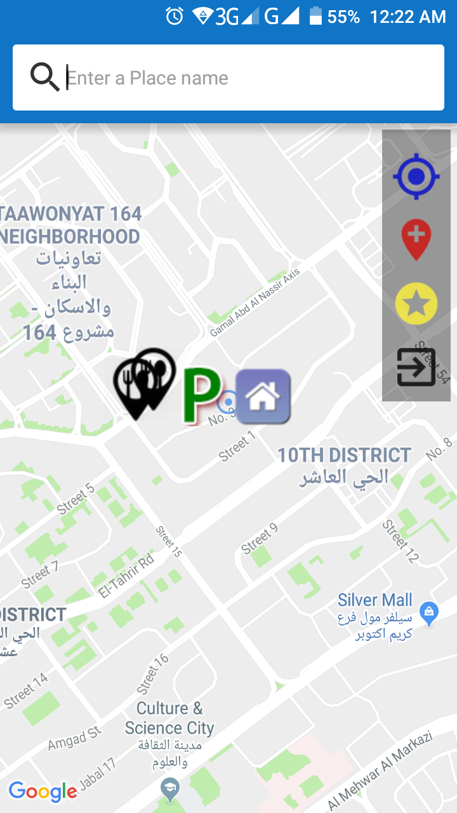
  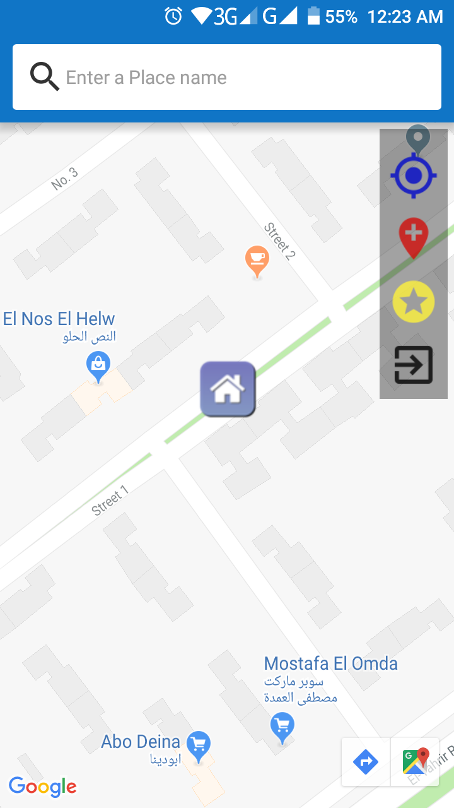
  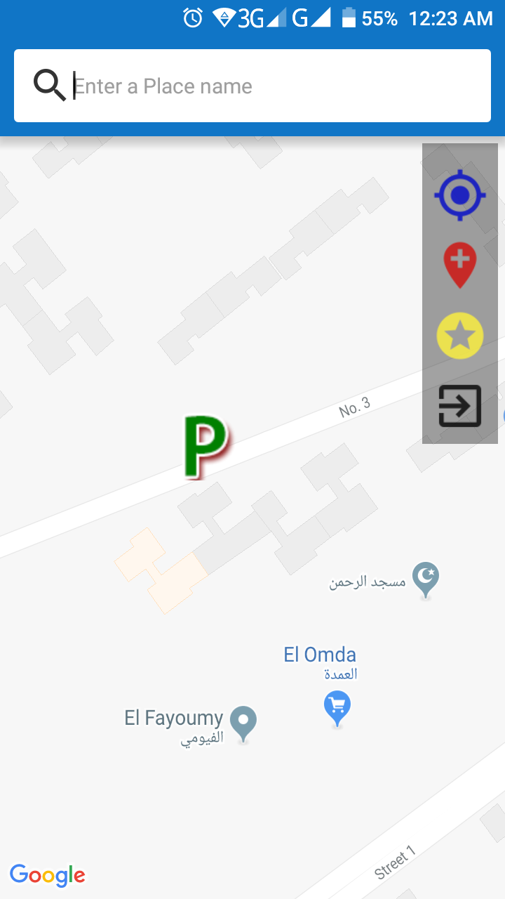
  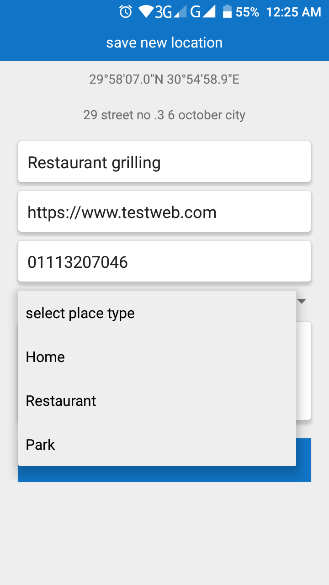
  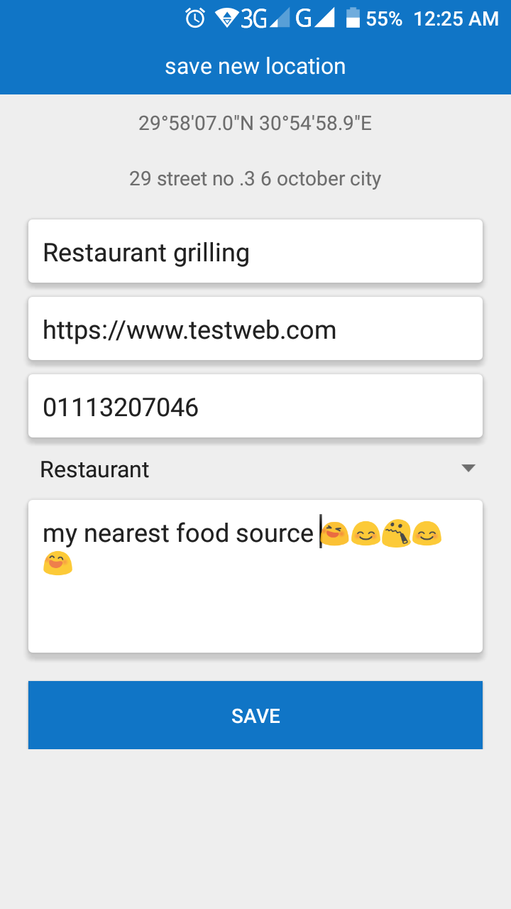
  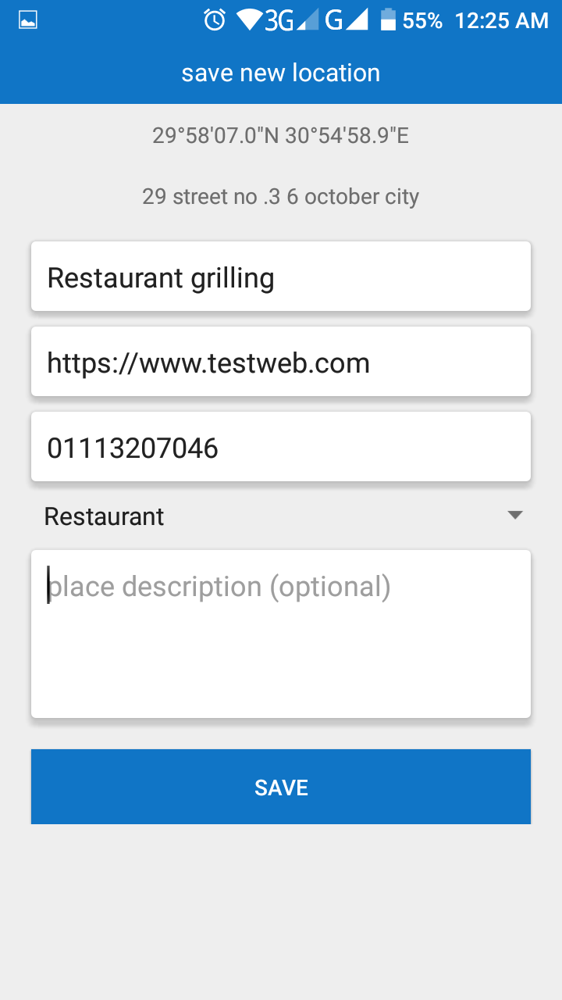
  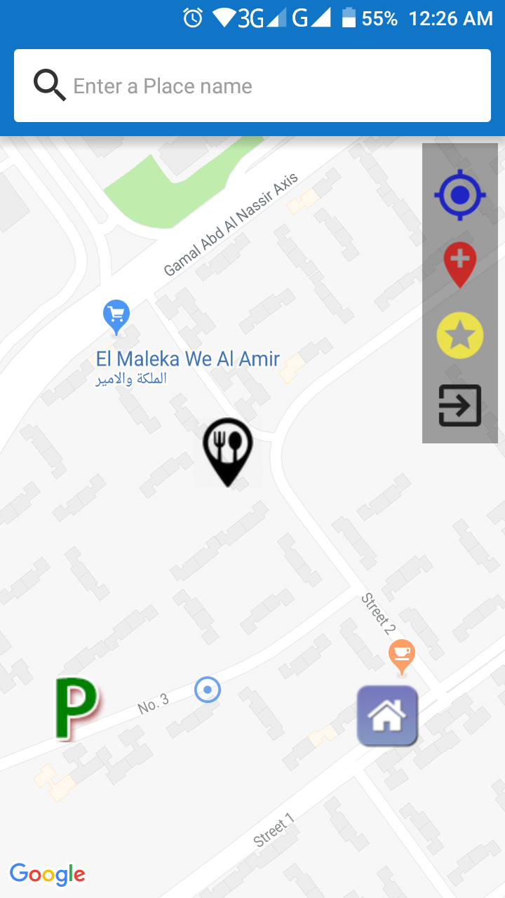
  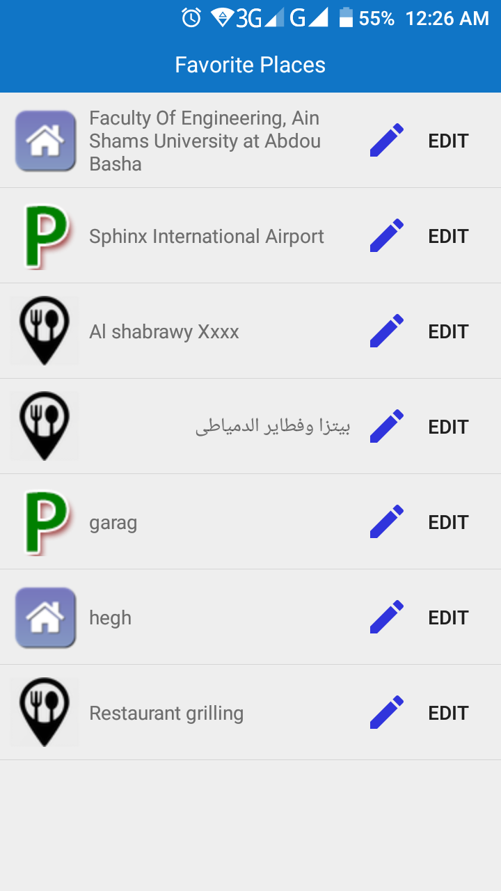
  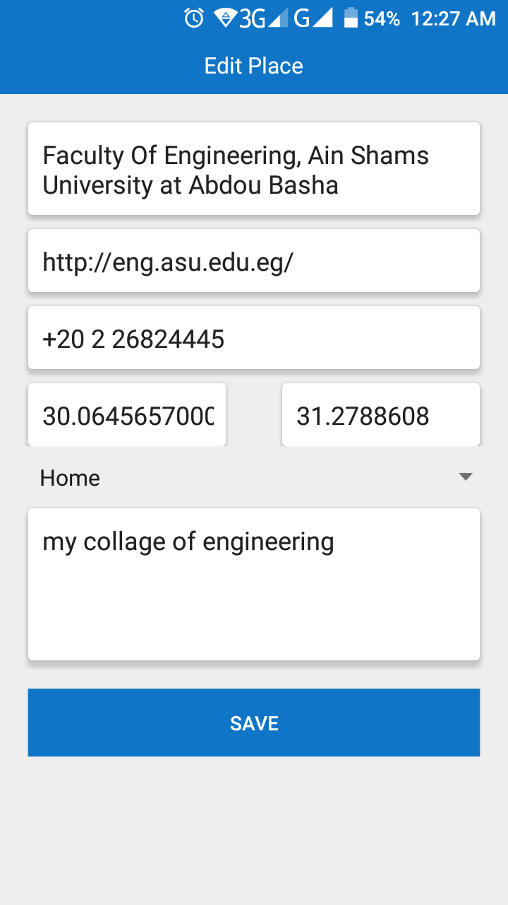
  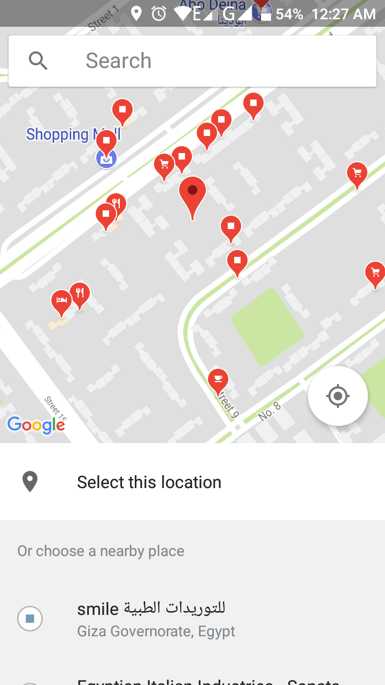
  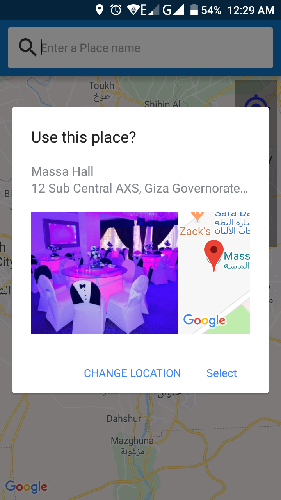
  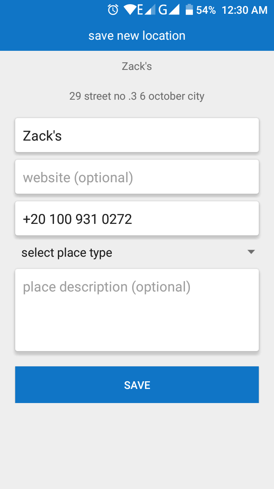
  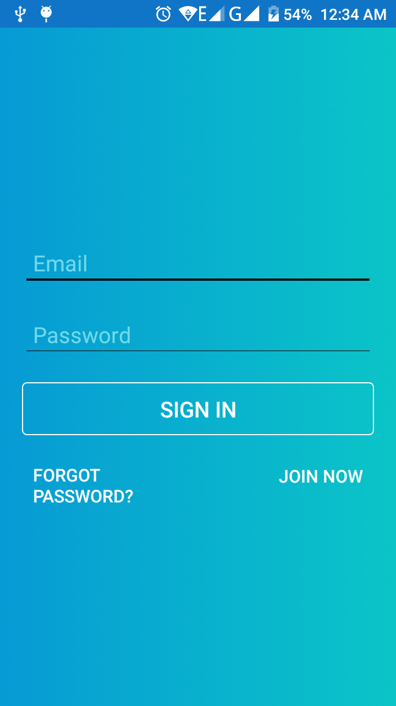
  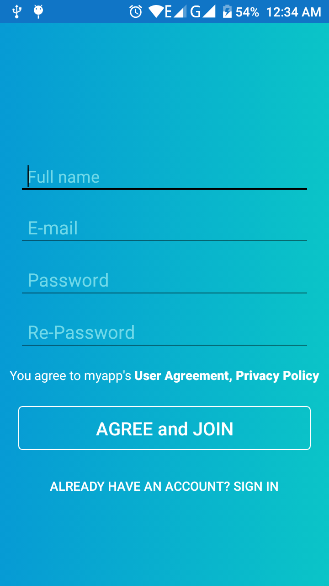

